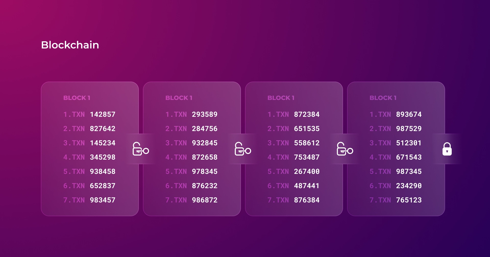
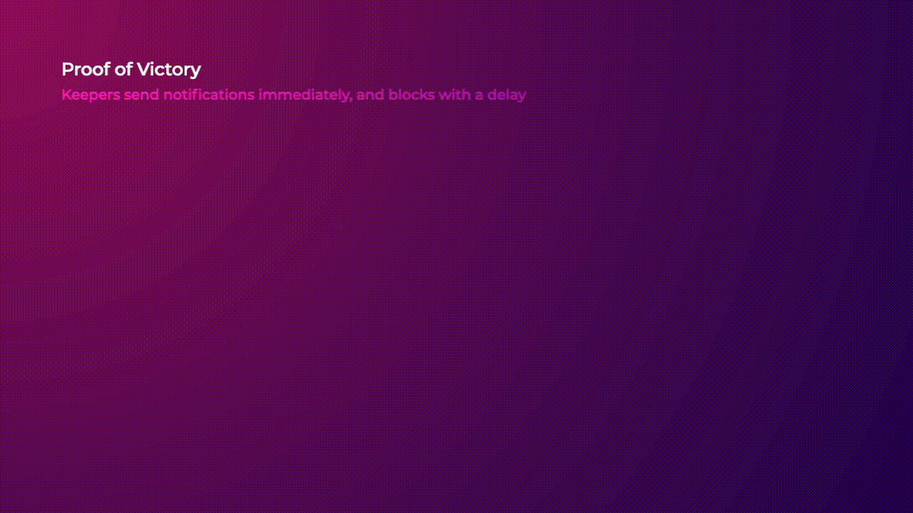
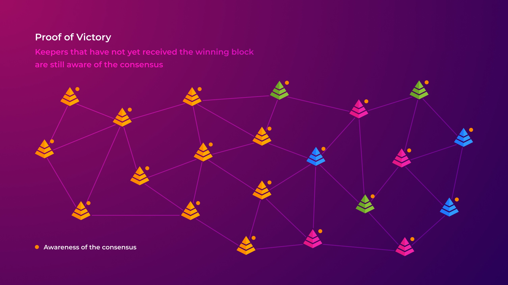

## What is consensus?

Any accounting is built on two simple principles. First, accounts cannot have negative balances. Indeed, what should a balance of shoes in stock of -5 pairs mean? And secondly, all transactions in the accounting are separated by time. In other words, the account's balance after each operation is actual for some time and, therefore, must be non-negative.

In mathematics, the expressions 3-4+5 and 3+5-4 are equivalent, but in accounting, the second operation (-4) in the expression 3-4+5 leads to a negative balance and must be canceled as incorrect. That is why the familiar from elementary school mathematical axiom stops working in accounting and should be fixed as follows: _changing the order of the addends does _~~_not_~~_ change the sum_. It happens because different balances are formed depending on the order of operations in the account: 3+5-4 = 4 and 3~~-4~~+5 = 8.

Suppose there is no single source of truth about the order of operations. In that case, the balance of the same account on two computers will quickly become different, as each will account for operations in its own order.

After all, the same transaction order is the main problem in public decentralized accounting systems. And before Bitcoin, setting the same transaction order for multiple nodes seemed impossible for two reasons.

First, real-world time cannot be relied upon since it is not perfectly synchronized between computers, there are delays in the network, and a malicious node can easily fake its own time. In other words, it is impossible to distinguish an attacker's operation with a fake time from the correct one, which has already been accounted for by most nodes but has not yet been delivered to the rest due to delays or technical problems.

Second, each node can produce its operations since they are equal. And, if the rate at which new transactions appear is comparable to the rate at which information spreads between nodes, then each node will eventually form its own unique order of operations. The following image shows how two operations performed with a time difference less than the communication speed between two nodes are accounted for in mirrored order.

When there is a single source of transaction order or when the result can take negative values, the problem of data synchronization between nodes is much easier.

But when transactions appear from many sources, and the balance of accounts can not become negative, there is no correct order of operations at all - for each node, its own sequence of operations will be the only valid.

Satoshi Nakamoto solved these problems with the blockchain concept. The general idea is that all transactions are grouped into blocks that form a consistent chain. A new block to join the chain must contain a key that is not known in advance and can only be obtained by brute force.

This way, any node can set its order of yet unaccounted operations. The calculations of the key by the nodes act as a protection of the canonical operation history against Sybil attacks.

The problem with this approach is that the chain of blocks can branch since each participant has a chance to find a key. It is possible to find the key to one of the old blocks, or it may happen that two participants find the current key almost simultaneously. Therefore, there should be a rule to determine which chain is canonical.

The need for computation gives the blockchain a new property - resource intensity. The more calculations are required to recreate the blockchain, the more resource-intensive it is and, as a result, the better it is protected.

Hence, the most protected chain of blocks must be considered canonical, and all nodes working according to the rules must continue it. The continuation of such a chain by most nodes makes it even more secure.

*It is believed that nodes must choose the longest chain. But this is not entirely true since there is also the complexity of the key that controls the time between blocks. Complexity depends on the number of zeros at the beginning of a key, which is just an ordinary hash. The more zeros are needed - the harder to find such a hash. Thus, forming a much longer chain of blocks is possible with less complexity. In other words, Bitcoin nodes choose the most protected chain, not the longest.*

Security estimation allows all interested parties to accurately determine the chain that all other participants, working according to the rules, will choose. And, if such participants are the majority, then malicious nodes will not have enough computing power for their alternative chain to catch up with the steadily growing canonical one.

Satoshi Nakamoto called this method of forming nodes' consensus on the order of operations Proof of Work. Although Proof of Work has proven to be a reliable solution, it has several serious drawbacks.

First, the brute forcing of a key is done by all the nodes in the network, and it consumes 0.5% of the world's electricity nowadays. Moreover, these calculations and electricity expenditures have no practical utility other than securing the canonical history against Sybil attacks.

Second, to make the chain split as rarely as possible, each new block must have time to get to most nodes, the number of which is unknown. For this purpose, Bitcoin has an average delay of 10 minutes between blocks, achieved by changing the complexity of the key. This delay and the block size limitation are disastrous for the network's throughput, which is only 3-7 transactions per second.

And last but not least, the chain's ability to branch makes real finalization impossible.

## Finalization

Finalization implies that one of the earlier branches of the blockchain in the future will not become canonical instead of the current one. In other words, finalizing a transaction means that it is stored in the blockchain forever.

The Bitcoin blockchain can have any number of branches. The only rule is to choose the most protected one. Because of this, it is theoretically possible to rewrite the transaction history (entirely or just the latest part), as the only barrier to this is the need for an enormous amount of computational power.

And there is no guarantee that someone right now is not trying to create a new canonical branch of the chain, even though it seems impossible. The future has a talent for surprises.

Someone may discover a mathematical model that finds a key much faster. Or physicists may create an alternative Bitcoin chain to compare the computational power while testing the first quantum computer. Or ordinary users may get fed up with the dominance of the big players in Bitcoin issuance and will unite in a pool to rewrite the whole blockchain from the moment of the first ASIC appearance. And, of course, we should not forget the potential of AI.

The only thing we can be sure of is that black swans happen. And they come as a complete surprise precisely because, until then, everyone thought such a scenario was impossible.

*The problem of unexpected events is covered in greater depth in Nassim Taleb's books: [Fooled by Randomness](https://en.wikipedia.org/wiki/Fooled\_by\_Randomness), [The Black Swan](https://en.wikipedia.org/wiki/The\_Black\_Swan\_\(Taleb\_book\)), and [Antifragile](https://en.wikipedia.org/wiki/Antifragile\_\(book\)).*

Conversely, finalization implies that the chain or part of it cannot be rewritten. But this requires some mechanism that does not allow the chain of blocks to branch. Such a mechanism assumes rules of joint work of nodes, which theoretically can be violated, eventually leading to a blockchain halt.

The logic of Bitcoin can be compared to the legislation formed by sequential public petitions. With this approach, only a tiny portion of the population signs petitions, so while the existing laws are updated with new petitions as usual, another group can start forming very opposite legislation. Their main task will be to collect a more significant total number of votes.

On the other hand, the work of blockchain with finalization can be compared to passing laws in parliament. There is only one legislation, but if most parliament members stop going to work and no quorum is gathered, laws will stop being passed. In addition, if one party gets a majority, it can pass conflicting laws or write them in pure self-interest.

In this case, to determine the majority of votes, it is necessary to know the total number of voters. Therefore finalization is impossible when the number of nodes is unknown. And if there is a known list of nodes, it is actually not a public blockchain.

For example, in Ethereum, after switching to Proof of Stake, there is a list of all nodes that have staked to participate in the consensus. So some blocks can be finalized when 66% of validators accept them, as it is possible to calculate how many signatures are needed precisely.

*Either the chain of blocks can branch, which makes finalization impossible, or there is a mechanism of joint work of a known number of nodes, which limits branching and can potentially be broken.*

## **Proof of Victory**

We believe it is better to know precisely how a system can break and what to do when it happens than to try to fix it after a super-reliable system eventually breaks down. That's why Proof of Victory is a consensus with finalization.

In general, the ability of a blockchain to branch arises because while some nodes have already reached a consensus on the next block, others do not yet know that and continue agreeing on a different block. And sometimes, they succeed.

The Proof of Victory consensus prevents this by spreading information about the block vote faster than the voting process itself. It results in instant finalization almost at the moment when most Keepers agree on one of the blocks using relatively simple rules.

#### 1. Each block has its own unique parameter of power

Unlike peer-to-peer systems that require consensus with built-in protection against Sybil attacks (such as PoW or PoS), the public cluster architecture allows the next block to be determined based on several independent criteria. In YETI, the following parameters are considered when calculating block power:

1. The size of the block's transaction count. If one Worker packs an order of magnitude more transactions than others, it has a much better chance of winning a reward.
2. The node queue. If a node created the previous block in the chain, it would not add to the power, and on the contrary, the further back in time the node made its last block, the more value will be added to the block power.

The power parameter based on the node queue and the number of packed transactions balances decentralization and performance. When the network load is high, the blocks containing many transactions formed by high-performance nodes will have a better chance of winning. When the activity decreases, all Workers, regardless of their performance, will pack approximately the same number of transactions, so the node's place in the queue will play a crucial role.

#### 2. Keepers forward only the strongest blocks to each other

Each Keeper must memorize one block with the most power. When Keeper receives another block, they are compared. If the received block has more power, the Keeper memorizes it.

#### 3. When a memorized block is replaced, Keeper sends the notification of the change instantly, while the block is sent with a delay

When Keeper replaces a memorized block, it instantly sends a notification to its neighbors. Then Keeper sends the block itself with a slight pause, depending on the block power - the more power, the shorter the delay.

Since a block is forwarded many times, its delay at each Keeper eventually sums up. For example, if the delay is 100ms (the average message forwarding time over the Internet), then the cumulative delay will be 1s when forwarding it sequentially ten times. It means that the notification from the first Keeper will reach the tenth, on average, one second earlier than the block itself.

Malicious nodes can either increase the delay or decrease it. However, increasing the waiting time will not change anything, as the block will propagate faster along workarounds.

And decreasing the delay by a malicious node will play a minimal role in the overall propagation time of the block since most Keepers working according to the rules will still delay it.

*While testing YETI to prevent the harm that can still be caused by malicious nodes accelerating blocks, we will experiment with synchronizing the delay. Roughly speaking, if the first notification was received 500ms ago, the block passed through 3 nodes after that, and the delay should be 200ms, then it is evident that the current Keeper should delay the block an additional 100ms.*

#### 4. Block, which several Keepers have already chosen, acquires the candidate status

While the block is transferred between Keepers, it collects their signatures. Each block that contains signatures from 5% of Keepers (but not less than three signatures) receives the candidate status.

A block with candidate status is considered stronger than a block without this status, meaning that the power parameter plays a role only when both blocks being compared either have candidate status or do not have it.

When only candidate blocks remain on the assertion layer, it becomes impossible for a new block to be accepted by any Keeper since even the strongest block will lose to a weaker candidate, if it was created with a delay.

The candidate status is necessary to avoid the constant emergence of more powerful blocks, which can significantly delay the consensus. Thus, three factors influence the block consent of the Keepers:

* The number of transactions in the block
* The place of a node in the queue
* The speed of block creation

#### 5. The strongest block chosen by the majority of Keepers is considered finalized

The main difficulty of consensus with instant finalization is to know which block the majority has chosen before some nodes from that majority have time to change their choice.

Due to the notification of the vote spread without delay, nodes, even those that have not yet taken part in the voting for the winning block, learn about achieved consensus.

If a node, upon receiving a notification, finds out that more than half of the Keepers have chosen the same block, then it can be sure that this block is finalized. After all, other Keepers will also know this sooner than the stronger block could theoretically reach the required level of agreement thanks to accumulating delays while nodes vote.

*The Proof of Victory consensus can be considered as a war on a world map. Each Keeper is a different country, and the blocks that enter the assertion layer through a particular Keeper act as its army.*

*The stronger the army, the less it has to rest after each battle. When a new country is conquered, messengers immediately rush in all directions carrying information about it.*

*If a country takes over 5% of the territories, it becomes an empire, and the armies of ordinary countries surrender to it without a fight.*

*When the strongest empire captures 51% of the territories, all other countries will know that based on the messengers' information. In this case, there is no need to continue the war since the winner is already evident to all. In other words, conquering 51% of territories can be seen as proof of victory for all of the parties.*

## 51% attack

When the chain of blocks can branch, like the Bitcoin chain, getting 51% of the voting power by one participant allows him to make a double-spending.&#x20;

To do that, he has to create a private chain of blocks (more secure than the canonical one), make a transaction in the public blockchain, and then publish his private branch, making it the new canonical one. Replacing the main blockchain with its more resource-intensive private branch will cancel the transaction.&#x20;

With the Proof of Victory consensus, this is impossible due to instant finalization. But for it to work correctly, it requires that the majority of Keepers work according to the rules.&#x20;

If an attacker gets most of the Keepers under his control (although this is a very unlikely event, we should still be prepared for it), he cannot commit double-spending since the chain of blocks in Proof of Victory cannot have branches. But he can disrupt the system by finalizing two blocks or not agreeing on any of the blocks.&#x20;

Since disruption will be evident to everyone, we propose considering such an intentional system breakdown due to an attacker's centralization of control over Keepers as critical. It is a sufficient reason for a soft fork followed by punishment for all Keepers.

All major blockchains have had soft forks due to critical bugs, so there is nothing terrible about that. What is scarier is facing a situation everyone thought impossible. Generally speaking, consensus without finalization can be compared to traveling in a cab with broken brakes, whose driver is unaware of it.

*The mere fact of declaring how the problem of gaining control over Keepers will be solved prevents this attack type. After all, such attacks are aimed not at making a profit but at destroying the system. So, if it is known in advance that the system will continue to work anyway, then there is no point in spending resources to overcome the Sybil attacks defense.*

## Summary

Proof of Victory fundamentally differs from other popular consensuses since it is not based on protection against Sybil attacks.

The public cluster architecture allows Keepers to choose a block based on criteria that are more useful for the system performance and fairness: the speed at which Workers create blocks, the number of transactions in the block, and the order of nodes participating in YET issuance.&#x20;

In addition, the small number of Keepers allows the consensus to be very fast - we expect blocks to be finalized every one or two seconds.&#x20;

Therefore, the Proof of Victory consensus is an optimal combination of fairness, reliability, security, and performance.
