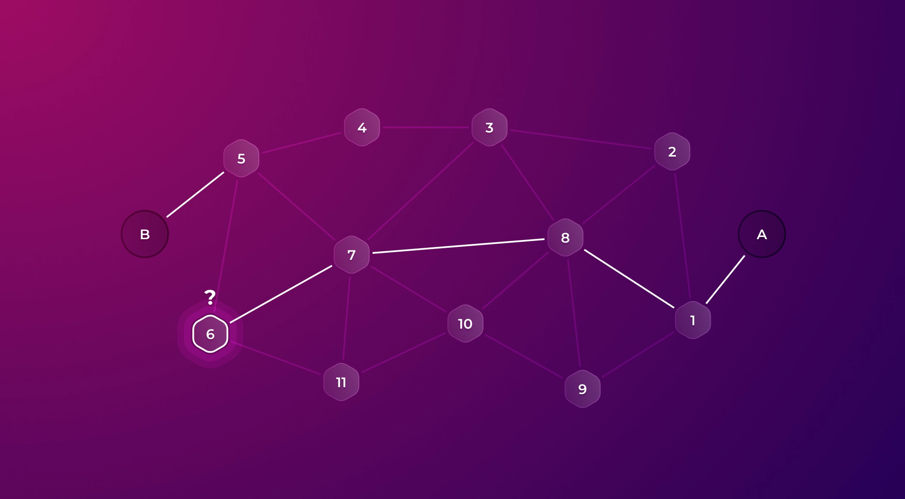
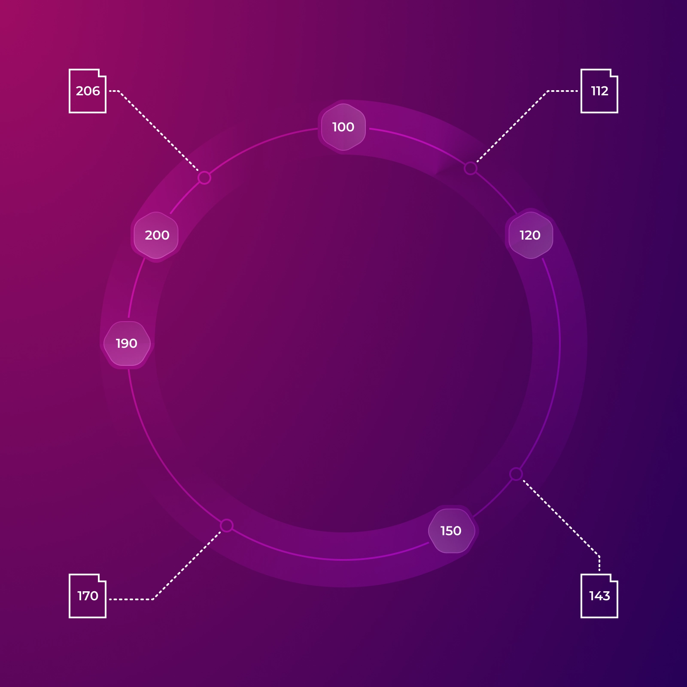
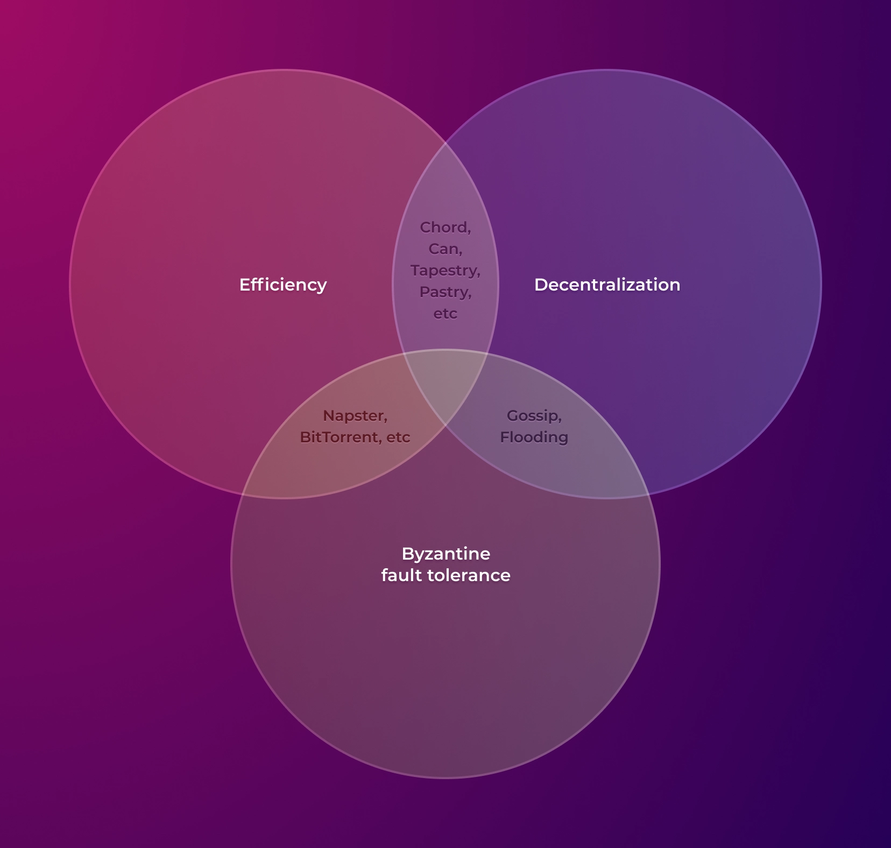
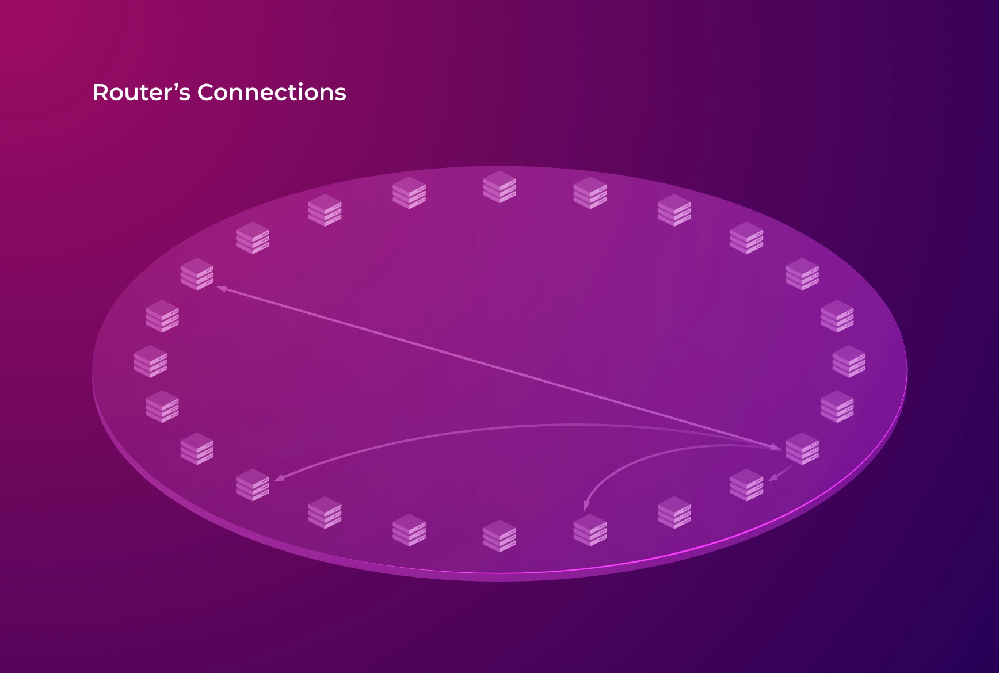
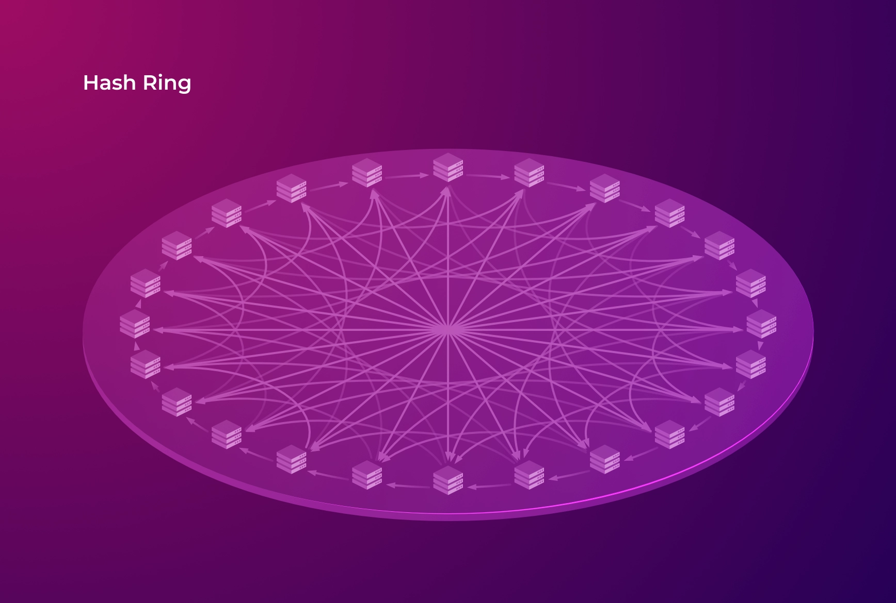

## Why is routing hard?

The problem of finding a route between two points is relevant in many areas of human activity: from parcel delivery by the postal service to the choosing of transfer stations in the subway.&#x20;

In computer technology, a route may be required, for example, to search for a desired file on multiple computers or to send a message to a particular client connected to one of the communication network nodes.&#x20;

Eventually, without the ability to build routes, the Internet could not work. But the global network is built on hierarchical principles, and in this section, we will try to understand the routing in a flat peer-to-peer network.

#### Map routing

At first glance, the task does not look complicated. After all, what could be easier than plotting the shortest route by looking at the map?

The problem lies in the fact that by looking at the connection diagram, we immediately estimate the entire topology of the network as if from _outside_. At the same time, in peer-to-peer systems, each node must somehow see the connection map from _within_ the system.

The first thing that comes to mind to achieve this is to store the map external to the system, say on a particular server. The developers of the first peer-to-peer systems did just that. But this centralized approach, even for individual functions, makes the system vulnerable, as has been proven in practice more than once.&#x20;

*For example, we can remember the story of Napster, when the search servers, which stored the routes to the files, were shut down by the government, and users lost access to search functionality, without which the rest of the system became meaningless.*

If placing the map on a separate server is a bad idea, can we implement a protocol for exchanging information about connections to help nodes form their personal vision of the map?

The main disadvantage of this approach is the time lag between changing a particular connection and notifying the other nodes in the network about it. For example, if, in the scheme, client B reconnects to node 5, the other nodes in the network will not immediately know about that and will continue for some time, sending all messages for B to node 6.

And as the number of network nodes grows, the problem will only get worse because the more nodes there are, the more often they will connect and disconnect, while the speed of information delivery to all of them will fall. So at some point, most messages will be sent via the wrong routes, built using outdated topology information.

In addition, as the complexity of the map increases, the search for the following route at each of its intermediate points will also become [exponentially](https://en.wikipedia.org/wiki/Vehicle\_routing\_problem) harder. In other words, the wider the maze, the more difficult the computational task is to find the way out. Moreover, since the labyrinth is also constantly changing, the problem of finding the optimal route will have to be solved at each point.

> When sending a message to a particular destination over a map that describes a relatively wide historical topology that keeps changing, either a centralized map is needed (where the information is updated faster than the average message travels along the route), or the message will likely never reach the target.

#### Overlay routing

After Napster was blocked, almost immediately protocols emerged that allowed not only storage but also searching the information in a decentralized way: [Chord ](https://en.wikipedia.org/wiki/Chord\_\(peer-to-peer\))(2001), [CAN ](https://en.wikipedia.org/wiki/Content-addressable\_network)(2001), [Pastry ](https://en.wikipedia.org/wiki/Pastry\_\(DHT\))(2001), [Tapestry ](https://en.wikipedia.org/wiki/Tapestry\_\(DHT\))(2004), and others.

The logic of these protocols is similar - a virtual address space (overlay) is created, within which all objects (such as files) are distributed for serving between nodes.

This approach is no different from the zip codes used by postal services in almost every country, where a postal code for a post office corresponds to several houses in its vicinity.

When using these protocols, since the topology is not taken as a given but is formed dynamically by specific rules, it is possible to effectively send a message from sender to receiver without building a general map of connections.

*In other words, the map is not the result of the connections between nodes but is the cause of them.*

For example, the Chord protocol involves creating an address space as a circle, each segment of which one of the nodes serves. In this case, each file (when we are talking about a system for storing data) corresponds to a specific point on the circle, which belongs to the responsibility area of a particular server.

The servers must be interconnected according to specific rules, which allows them, even without an entire connection map, to know where to forward the request so that it gets closer to the server where the desired file is stored.

But for such a correct and efficient system, a topology with the proper structure is required. And this is where problems arise because, without a single source of truth about the topology, the joining node has to trust one of the neighbors (bootstrap node).

It allows attackers to mislead newcomers when they connect, causing local topology disruptions. Because the deceived nodes will have the wrong map view, they will, in turn, involuntarily act as malicious bootstrap nodes. Thus, even a single local topology violation will further escalate until it destroys the system.

In addition, without a single source of truth, there is no way to neutralize malicious nodes that confirm their availability but do not forward client requests.

> A structured topology allows addressable message forwarding in a decentralized and efficient manner. But such a topology can not be protected from the actions of malicious actors.

#### Blind routing

Thus, no matter how we use a route map, we cannot build a fault-tolerant and decentralized system within a flat peer-to-peer network. Can it be done without a map at all?

Without a map, each node knows only its neighbors, which it can communicate directly. Obviously, with this approach, it is impossible to determine the exact neighbor to whom a particular message should be sent to get closer to the destination.

That is why the logic of [Gossip ](https://en.wikipedia.org/wiki/Gossip\_protocol)and [Flooding](https://en.wikipedia.org/wiki/Flooding\_\(computer\_networking\)) protocols, explicitly created for such architectures, implies that the messages received by the node are sent to all its neighbors.&#x20;

The difference in protocols is only in detail. While Flooding does it immediately and creates a heavy load on the network, Gossip spreads network load over time, causing message forwarding to be noticeably slower.

Both protocols can be combined within the same network. For example, the most critical messages can be sent via Flooding, and the less important via Gossip. As a result, different implementations of Flooding / Gossip work in all unstructured networks where connections between nodes are formed randomly (most often, nodes are connected manually).

Such networks with no inner structure do not allow malicious actors to attack the topology since it is impossible to break the rules of nodes' interconnection if they do not exist.

Moreover, even if a malicious node does not do its forwarding work, messages will still reach all nodes via workarounds. And if such a malicious node does not accept connections, newcomers can join the network via any other node.

Not surprisingly, this approach was used by Bitcoin. But as in all other areas, the price for reliability was a decrease in efficiency. Since the number of working nodes is unknown and, as a result, it is not clear how long it takes to deliver a block to most nodes, Bitcoin's design assumes an excessive ten-minute delay between blocks.

> Forwarding messages to all neighbors does not imply the possibility of addressable message delivery, which makes effective communication between two nodes impossible. After all, any message will eventually pass through all possible routes. And the network load will grow exponentially as the number of nodes increases.

## DEB theorem

When implementing a communication protocol for a flat peer-to-peer network, depending on the topology formation approach, it is possible to provide no more than two of the following three properties:

* Decentralization - all system functions are performed exclusively by network nodes themselves;
* Efficiency - while the messages to particular recipients are delivered the fastest possible way, the network load grows slower than the number of nodes in the network;
* Byzantine Fault Tolerance - the malicious behavior of one or more nodes can not irreversibly damage the system.

## Elysium Hash Ring

According to the DEB theorem we have just formulated, building effective communication in a decentralized peer-to-peer network is impossible. Precisely because of this, the development of genuinely decentralized systems is now in deep crisis.

But the DEB theorem is relevant only to a flat peer-to-peer network. It does not apply to a hierarchical public cluster architecture, which for the first time, provides an opportunity to achieve all three properties: decentralization, efficiency, and resistance to malicious node behavior.

In the Elysium public cluster, decentralization is guaranteed by an ownerless approach, efficiency is achieved on the address layer due to the structured topology, and robustness against malicious node behavior is ensured by the fact that the asserting layer has the BFT property and, as a result, can act as the single source of truth for other layers, also giving them the BFT property.

The assertion layer's resilience to malicious node behavior is achieved by the absence of any structure and connection rules between Keepers and by communicating using Flooding / Gossip protocols. It makes it possible to form a peer-to-peer network on the assertion layer that operates on the same principles as the Bitcoin network.

In addition, the very top of the hierarchy position of the assertion layer effectively balances fault tolerance and the information distribution speed on this layer since it is secured against various attack types and the number of Keepers is limited.&#x20;

The address layer is formed as a structured Hash Ring topology, assuming all possible wallet address space is rolled into a ring. Routers are placed on this ring according to their address and are responsible for the sector further clockwise up to the next Router. In other words, the entire address ring is divided between the Routers into zones of responsibility.

Workers and Users, knowing their wallet address, can match it exactly to the address ring and understand which particular Router should serve them. Thus, each participant is attached to one specific Router, allowing everyone to determine precisely where the message addressed to a participant should be sent along the ring.

At the same time, each of the Routers must be connected to several other Routers further clockwise so that the greater the distance from the Router, the less rare its neighbors are.

More details about the logic of the address ring and the rules for connecting Routers can be found in the description of the Chord protocol since, in these aspects, Hash Ring is fully compatible with it.

The process of topology building is the main difference between Hash Ring and Chord protocols. While the Chord protocol produces the network based on local interaction rules between nodes, the Elysium public cluster's address layer is formed based on data stored in the blockchain.

*There are [reasonable doubts](http://www.pamelazave.com/chord-ccr.pdf) that the local nodes' interaction in the Chord protocol is guaranteed to form a perfect address ring in any situation (even without considering the participants' malicious behavior).*

Storing information about currently working Routers in a blockchain, whose consensus operates on a higher hierarchical layer, not only allows forming an address ring much more reliably than using the Chord protocol but, more crucially, it gives the BFT property to a network with a structured topology when several rules are enforced.

#### Message forwarding in the address layer

One of the biggest problems with addressing messages from a BFT perspective is that the most efficient way to forward a message is via a single path. Thus, if a malicious node doesn't deliver the message further along the route, the source and destination nodes won't know about it. It allows an attacker to censor certain transactions to specific wallets.

Of course, it is possible to implement a confirmation system for message delivery. But still, the confirming message will only be sent via one route (even if it is different). If lost, the sender will find himself in the initial situation when he cannot be sure about delivery success. So discarding delivery confirmations allows malicious nodes to create the same threat to the system as censoring the messages themselves.

A much more straightforward and, more significantly, functional method of increasing fault tolerance in any engineering system where increased reliability is needed is to duplicate critical communication channels. Therefore, in the Elysium address layer, each message must be sent by the initial Router to which the sender is connected to all of its neighbors.

Of course, forwarding over multiple routes increases the network load, but it will grow slower than the number of Routers. Eventually, it is still much more efficient than delivering messages over all possible routes when working with the Flooding / Gossip protocol.

This approach, while increasing the reliability of message delivery, also allows the final node of the path to determine the failure of individual routes, which makes it possible to self-clean the topology from malfunctioning and malicious Routers.

#### Connecting and disconnecting the Router to the address layer

As noted earlier, when a network with an unstructured topology grows, the map of links between nodes (the routing table) increases exponentially, and as a result, finding a node for further forwarding at each of the routing points can become a computationally challenging problem even for the most powerful computers.

In the case of the Hash Ring protocol, nodes do not need to learn the entire network topology to know which of their neighbors is closer to the endpoint of the route and to which node, respectively, the message should be forwarded further.

Moreover, since the topology is built according to unified rules, it can be reconstructed entirely with only the working servers' addresses. The blockchain will maintain such a list of working Routers.

A node can join or leave the address layer by making a blockchain transaction that lets others know about the change in the Router list. In other words, a node enters or leaves the list of working Routers on its own.&#x20;

The exclusion of a Router from the list can also be made based on one of the two blockchain transactions generated by other nodes.

If a Router shuts down, the neighboring Routers to which it is connected must notify their Keepers. These messages are distributed to the entire assertion layer. Suppose a particular Keeper collects information about the Router being turned off from most of its neighbors. In that case, it must generate a transaction to remove it from the list of working Routers. Such a transaction would contain signed messages from multiple Routers as proof, allowing it to be validated by all nodes hosting the blockchain.

A slightly more complicated case is when the Router, due to malfunction or malicious intent, confirms its functionality to its neighbors but at the same time does not perform its duties of forwarding messages. Such Routers will be detected based on the routes the message did not pass through. If multiple failed paths overlap at one point, there is a high probability that something is wrong with that Router.

To identify such nodes, the Router, at the end of the route, after receiving the first copy of a message, waits some time for the remaining copies of that message. If at least one copy does not arrive, it reports the failed route to the Keepers, which must distribute information throughout the assertion layer.

If a Keeper has accumulated several routes with different start and end points that overlap in the same node, it must form a transaction to exclude that Router from the list. Such an exclusion transaction is based on messages from several nodes, which can serve as proof for other participants.

Reconnection must require the Router to spend Silver to make disconnection from the address layer a punishment for a malicious or broken Router.

*The definite waiting time of all copies and the number of required faulty routs to exclude the Router from the list will be determined more precisely based on our experiments during the network tests.*

#### Vertical layers connection

Participants of all levels within the Elysium public cluster are motivated to support vertical integration of the layers, as the reward for each block goes to the nodes working on each layer.

Workers and Users will be programs on home computers, and the Routers will be the access points for connecting to the public cluster. To work in a Hash Ring single address space, the client must connect to the specific Router responsible for the sector of the address ring to which the client belongs. The client will be able to change its binding to the address ring in case of malicious behavior of its Router.

Besides that, clients establish connections to several additional Routers so that if the primary Router goes down, they can seamlessly connect to the new responsible Router that will replace the one that went down.

Routers, in turn, can connect to any number of Keepers, which makes it impossible to censor the delivery of approved blocks by individual malicious Keepers.

## Summary

A structured topology on one of the layers of the Elysium public cluster opens up for the first time the possibility of an efficient and maliciously resilient search of routes between participants in an ownerless system.

This unicast communication between nodes can be used in many cases not possible at the moment: from decentralized file storage to an ownerless messenger.

Elysium will primarily use one-to-one transmission as a transport protocol for exchanging crypto assets and information.
